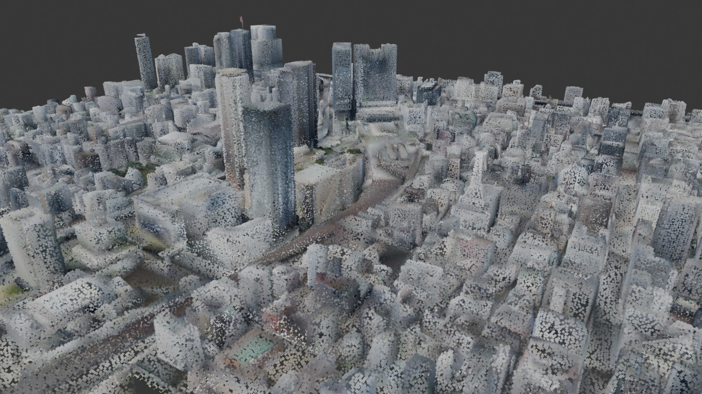
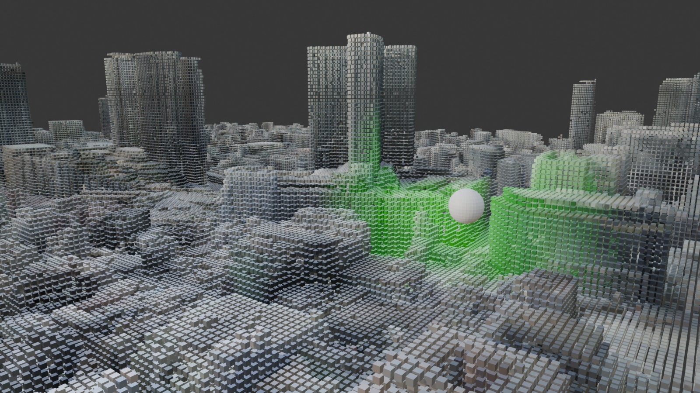
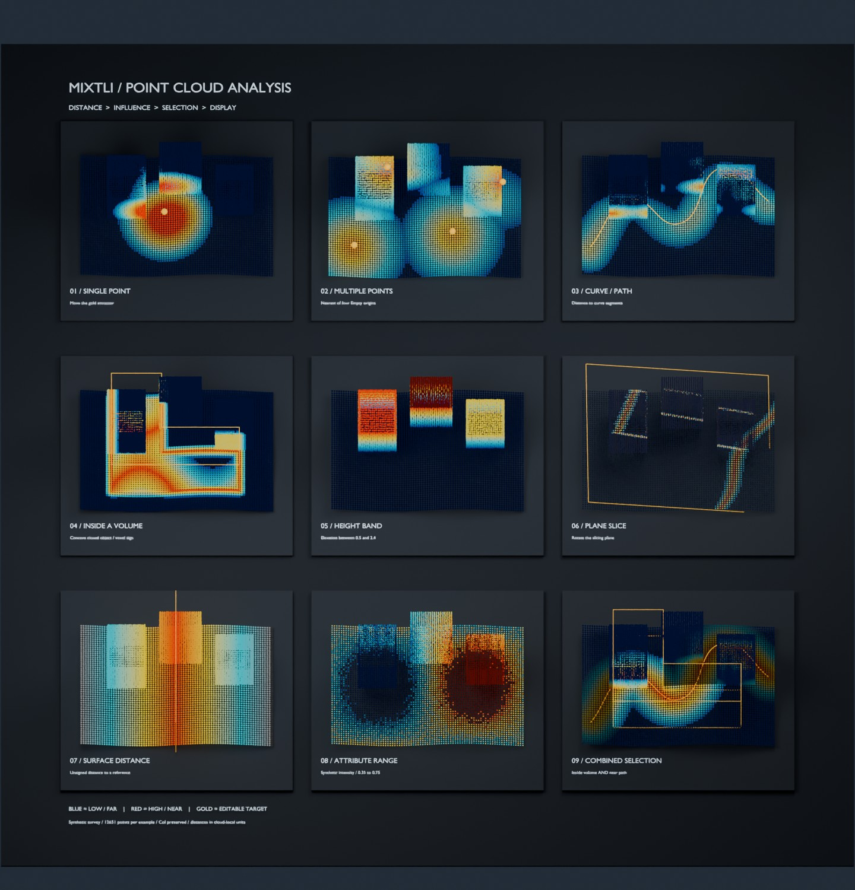
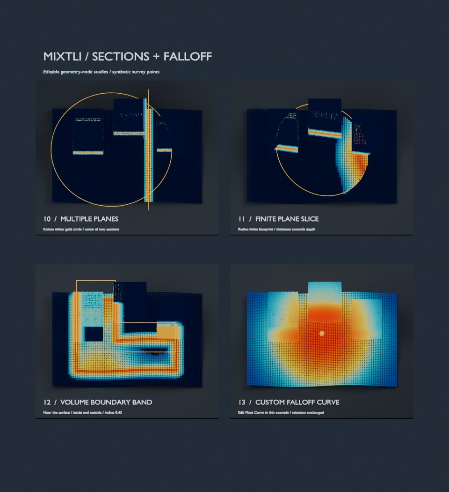
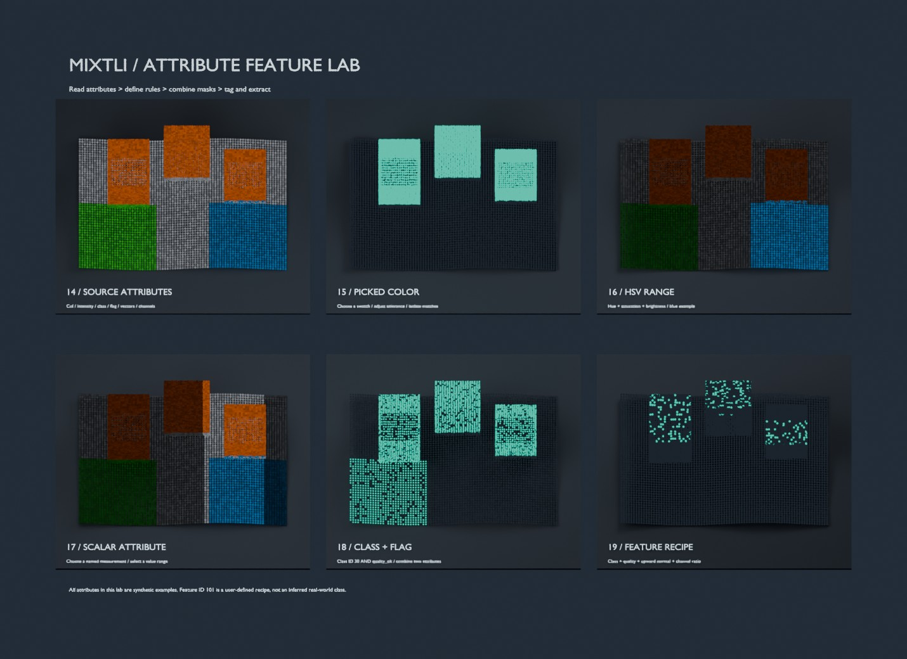

# Mixtli

**Generate, analyse and visualise point clouds.** *Mixtli* is Nahuatl for cloud.

Mixtli brings point clouds into Blender, gives you tools to interrogate them,
and renders the answer.

- **Generate** - from a textured mesh, however many material slots it carries,
  or from a cloud you already have.
- **Analyse** - select by distance, section, volume, height, or by an attribute
  the cloud came with.
- **Visualise** - results come out as colour, ready to light and render.

Point-cloud analysis tools exist elsewhere. What Blender adds is that the
answer is already an image.

## Install

Download the `.zip` from [Releases](https://github.com/luigipacheco/mixtli/releases),
then **Edit > Preferences > Get Extensions > Install from Disk**.

Blender 4.2 or newer. Works in EEVEE and Cycles.

## Quick start

1. Select a textured mesh - or an imported point cloud, either works.
2. Press `N` in the 3D view and open the **Mixtli** tab.
3. Click **Mesh to Colour Point Cloud**.
4. Leave the defaults and confirm.

You get a new `<name>_pointcloud` object. The original is never modified.

For a voxel grid: set **Points From** to *Regular Grid*, give **Voxel Size** a
value in metres, then raise **Scatter Points** until the dialog reads 25-50
points per cell. Set **Cell Position** to *Cell Centre* for a true lattice.

## Use

Select a mesh, open the **Mixtli** tab in the 3D view sidebar (`N`), hit the
button. Set the options in the dialog and confirm.

Already have a point cloud? Select that instead. Mixtli detects a `PointCloud`
object or a face-less mesh (how `.ply` clouds import), skips straight past the
material flattening, and offers just the grid and radius options - so you can
voxel-grid an imported scan, or simply give it a material and a live radius
slider.

**Points From** picks how the cloud is built:

| Mode | Output | Good for |
|---|---|---|
| Scatter on Faces | Mesh + geometry nodes | Live density you can scrub |
| Mesh Vertices | Mesh + geometry nodes | One point per vertex |
| Regular Grid | Real PointCloud object | Voxel grids, cleanup, PLY export |

The dialog shows a live estimate of point count, spacing and radius as you
change settings, so you can tell before committing whether the numbers make
sense for your object.

### Regular Grid

- **Voxel Size** - grid cell size. 0 keeps the raw scattered points.
- **Scatter Points** - aim for 25-50 per cell (shown live). Too few and the
  grid comes out with holes.
- **Cell Position** - *Centroid* follows the surface, *Cell Centre* snaps to a
  perfectly regular lattice.
- **Min Points / Cell** - drops sparse cells. Cheap outlier removal. Keep it
  below the points-per-cell number or it deletes most of your cloud.
- **Export PLY** - under Advanced. Binary, with colour.

Output is a real `PointCloud` datablock with `position` / `radius` / `Col`, so
you can stack geometry nodes on it afterwards.

**Add Display Node Group** (Advanced, on by default) attaches a small shared
modifier with a **Radius Scale** slider, so point size stays adjustable
afterwards without re-running anything. It multiplies the stored per-point
radius rather than setting an absolute one, so a single group stays correct
across objects of any scale.

*Cell Centre grid, post-processed in geometry nodes: distance to the sphere
drives a Map Range into a colour mix.*

## Analyse

Mixtli ships a library of geometry-node groups for asking questions of a point
cloud, and registers it as an asset library on install. Open the Asset Browser
and look under **Mixtli**, or drag a group straight into a geometry-nodes tree.

Ask spatially - distance to a point, a set of points, a curve corridor or a
surface; inside a closed volume or the band near its boundary; plane and
multi-plane sections; height bands. Or ask by attribute: select a numeric range
on any named attribute the cloud carries.

| Catalog | Groups |
|---|---|
| Selection and Distance | point / multi-point / curve-corridor attractors, inside-a-closed-object, height band, plane slice, multiple plane slices, surface distance, attribute range |
| Display | heatmap point display |
| Utilities | combine selections, point statistics, points adapter, falloff curve |
| Starters | ready-made single-attractor and multi-plane setups |

Most analysis groups output `Distance`, `Influence`, `Selection` and `Valid`,
so they compose: feed any of them into **MX 10 | Heatmap point display** to
colour by the result, or into **MX 09 | Combine selections** to intersect two
of them. **MX 12 | Points adapter** takes a mesh or a point cloud and hands
back points, so the groups work on either.

**MX 11 | Point statistics is optional.** Nothing depends on it - no other
group calls it, and a selection works fine without it. It exists to read
numbers off a result: total and selected counts, selected fraction, and the
min, max and mean of the analysis value. Add it when you want the figures,
leave it out otherwise.

*Nine of the analysis groups on synthetic survey points. Blue is low or far,
red is high or near; gold marks the object you move.*

*Plane sections, volume boundary bands, and an editable falloff curve.*

### By source attribute

Point clouds arrive carrying data - colour, intensity, classification codes,
return numbers, normals. These groups read what is already there and turn it
into a selection.

| Group | Selects by |
|---|---|
| MX 17 \| Read source color | reads a colour attribute; RGB, HSV, luminance and alpha out |
| MX 18 \| Match source color | nearness to a picked swatch, optionally ignoring brightness |
| MX 19 \| HSV color range | hue, saturation and brightness bounds |
| MX 20 \| RGB vegetation candidates | green dominance, `ExG = 2g - r - b` |
| MX 21 \| Class ID selection | an integer class, or a range of them |
| MX 22 \| Vector attribute filter | a vector's length, or its alignment to a direction |
| MX 24 \| Boolean attribute rule | a boolean attribute being true or false |
| MX 25 \| Attribute relationships | difference, ratio or normalised difference of two attributes |
| MX 27 \| Scalar field rule | an inclusive numeric range on any scalar field |
| MX 26 \| Tag and extract feature | writes a feature ID and score, and splits matched from remaining |

Colour work happens in **display sRGB** by default, because that is the space
colour thresholds are normally quoted in. Mixtli stores `Col` as linear and
these groups convert on the way in; turn off **Use Display RGB** to stay
linear. The one exception is `MX 17`'s **Luminance**, which is always linear,
because that is what luminance means.

Worked examples: vegetation from ordinary photogrammetry colour is `MX 20`
into `MX 26`, tagged and split out. Classified LiDAR is `MX 21` with the ASPRS
code you want - 2 ground, 3-5 vegetation, 6 building, 9 water. With a
near-infrared and a red band, `MX 25`'s Normalized Difference is NDVI.

*Reading attributes, then narrowing: source data, a picked swatch, an HSV
range, a scalar range, two attributes combined, and a feature recipe that
stacks class, quality flag, surface direction and a channel ratio.*

## Visualise

**MX 10 | Heatmap point display** turns any analysis result into colour.

- **Heatmap Low / Mid Low / Mid High / High** - four stops across the
  normalised value.
- **Use Selection Colors** - flat selected/unselected colours instead of the
  heatmap, for reading a selection at a glance.
- **Size By Value** with **Radius Gain** - magnitude reads as size as well as
  hue.
- **Isolate Selection** - delete unselected points rather than dimming them.
  **Unselected Brightness** sets the dimming when it is off.
- **Original Color Mix** - blend the source colour back over the analysis, so
  the photographic texture stays underneath.

It also writes `mx_value`, `mx_weight`, `mx_selected`, `mx_valid` and
`mx_viz_color` as point attributes, so later nodes - or a script - can read
what it decided.

## Notes

Colour comes from reading texture pixels through the UVs - no bake, no UV
unwrap, seconds not minutes. Shaders too complex to resolve fall back to a
Cycles bake automatically. sRGB is decoded to linear so colours do not come
out gamma-shifted.

Both engines render Mixtli output the same way: the point material is an
emission shader reading a colour attribute, which EEVEE and Cycles agree on.
Cycles is needed only for the bake fallback, because EEVEE has no bake
operator - and if Cycles is disabled, Mixtli tells you rather than failing.

Only needs numpy, which Blender already ships.

## Licence

GPL-3.0-or-later.
